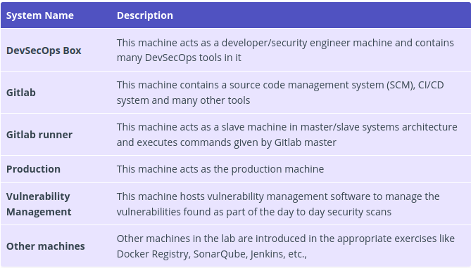
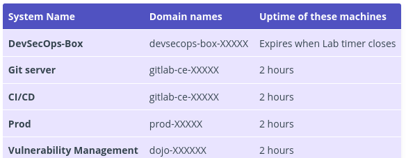

Understanding The Lab Setup
================================================

Thank you for taking Practical DevSecOps training.

Please read this lesson carefully as it contains instructions for connecting to our online labs.

Welcome to Practical DevSecOps Labs
--------------------------------------------------------

Welcome to the world’s most comprehensive DevSecOps course. The practical DevSecOps course is designed to help individuals and organizations in implementing DevSecOps practices. By Implementing these practices, we can achieve massive scale in security and reliability.

By the end of this course, you will be able to embed security as part of DevOps or in CI/CD pipelines with confidence.

Support Channel
----------

Got any questions? Contact us in the cdp channel on the slack.

Lab Architecture and Tools
----------

> Learning DevSecOps is all about experimentation, trying out new things, and observing the result! As you experiment, you may want to reset your exercise to the starting state by refreshing the page.

Our Labs are designed with real-world examples, and from our consulting experiences with our clients, these are not simulated exercises but real-world implementations.

This class teaches techniques to implement DevSecOps with lots of open source tools, but some of the things might not apply to you because you are not using that technology. That’s okay, as the techniques will be the same for other technologies used in your organization, even for commercial tooling

Various machines in the lab
----------

We have numerous machines in the lab. Each of these machines serves a purpose.

Machines in the lab and their domain names
----------

Important Note
----------

> We cover a wide variety of tools in the labs (only relevant tools are covered for a course). You can see that we have a git server like Gitlab and GitHub, you also have Jenkins and Travis. Don’t worry, if you don’t know these systems, we will cover each of them in the coming lessons. But the idea is to show you a complete on-premise DevSecOps setup, and then a complete SaaS set up so you can implement these solutions based on your organization’s culture, e.g., banks usually prefer on-premise solutions because of obvious reasons (regulations, policies, etc.,) and startups, unicorn firms tend to use more SaaS-based solutions.

Lab Setup Philosophy
----------

The lab setup is designed based on the enterprise networks; however, instead of using a VPN, our browser-based portal logs you in the VPN without a VPN client. The machine you land on is DevSecOps-Box, which acts as a jump box or bastion host.

Only the necessary machines are provisioned for the exercise, and not all machines might be available for every exercise.

This is done for two reasons
1. Speed up the lab provisioning time
2. To reduce the cognitive load on you

Access Deployed Web Services and ports
-----------

We deploy multiple services in the backend to make your learning journey easy.

For example, we have provisioned a vulnerable web application on the production machine. You can access it by using the following link.

Conclusion
---------

In this exercise, you have learned the lab setup and architecture.

The lab setup is similar to any enterprise CI/CD stack, and only the necessary machines are provisioned for the exercise, and not all machines might be available for every exercise.