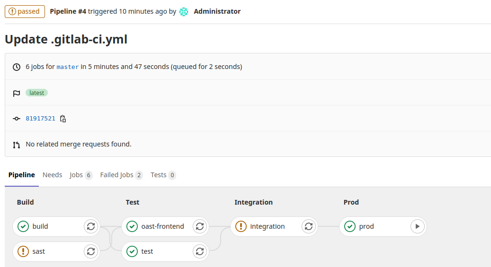

Learn how to embed Bandit into CI/CD pipeline
================================================================

Use Bandit tool to do SAST in CI/CD pipeline
----------

In this scenario, you will learn how to embed SAST in CI/CD pipeline.

You will learn to use Bandit in CI/CD pipeline and how to allow job failure when the tool found several issues.

A simple CI/CD pipeline
----------

Considering your DevOps team created a simple CI pipeline with the following contents.

```
image: docker:latest

services:
  - docker:dind

stages:
  - build
  - test
  - release
  - preprod
  - integration
  - prod

build:
  stage: build
  image: python:3.6
  before_script:
   - pip3 install --upgrade virtualenv
  script:
   - virtualenv env
   - source env/bin/activate
   - pip install -r requirements.txt
   - python manage.py check

test:
  stage: test
  image: python:3.6
  before_script:
   - pip3 install --upgrade virtualenv
  script:
   - virtualenv env
   - source env/bin/activate
   - pip install -r requirements.txt
   - python manage.py test taskManager

integration:
  stage: integration
  script:
    - echo "This is an integration step"
    - exit 1
  allow_failure: true # Even if the job fails, continue to the next stages

prod:
  stage: prod
  script:
    - echo "This is a deploy step."
  when: manual # Continuous Delivery
```

We have four jobs in this pipeline, a build job, a test job, a integration job and a prod job. We did integrate SCA/OAST beforehand, we can carry forward the same tactics in this exercise as well.

As a security engineer, I don’t need to care much about what the DevOps team is doing as part of these jobs. Why? imagine having to learn every build/testing tool used by your DevOps team, it will be a nightmare. Instead, rely on the DevOps team for help.

Let’s login into the GitLab using the following details and execute this pipeline.

GitLab CI/CD Machine
--------------------------------
**access to your gitlab**

Next, we need to create a CI/CD pipeline by replacing the .gitlab-ci.yml file content with the above CI script. Click on the Edit button to replace the content (use Control+A and Control+V).

Save changes to the file using the Commit changes button.

Verify the pipeline run
----------

As soon as a change is made to the repository, the pipeline starts executing the jobs.

Click on the appropriate job name to see the output.

Exercise
---------

Recall techniques you have learned in the previous module (Secure SDLC and CI/CD).
1. Read the [bandit documentation](https://github.com/PyCQA/bandit/tree/master/bandit)
2. Embed SAST backend tool, Bandit in test stage with job name as sast
3. Ensure the job is running under the test stage
4. After the above steps, move it to the build stage now
5. You can either install Bandit manually or use hysnsec/bandit docker container
6. Follow all the best practices while embedding Bandit in the CI/CD pipeline, and don’t forget the tool evaluation criteria

> Please try to do this exercise without looking at the solution on the next page.

Embed Bandit in CI/CD pipeline
------------------------------------------------

As discussed in the Static Analysis using Bandit exercise, we can embed Bandit in our CI/CD pipeline. However, do remember you need to run the command manually before you embed this SAST tool in the pipeline.

```
image: docker:latest

services:
  - docker:dind

stages:
  - build
  - test
  - release
  - preprod
  - integration
  - prod

build:
  stage: build
  image: python:3.6
  before_script:
   - pip3 install --upgrade virtualenv
  script:
   - virtualenv env
   - source env/bin/activate
   - pip install -r requirements.txt
   - python manage.py check

test:
  stage: test
  image: python:3.6
  before_script:
   - pip3 install --upgrade virtualenv
  script:
   - virtualenv env
   - source env/bin/activate
   - pip install -r requirements.txt
   - python manage.py test taskManager

sast:
  stage: build
  script:
    # Download bandit docker container
    - docker pull hysnsec/bandit    
    # Run docker container, please refer docker security course, if this doesn't make sense to you.
    - docker run --user $(id -u):$(id -g) -v $(pwd):/src --rm hysnsec/bandit -r /src -f json -o /src/bandit-output.json
  artifacts:
    paths: [bandit-output.json]
    when: always

integration:
  stage: integration
  script:
    - echo "This is an integration step"
    - exit 1
  allow_failure: true # Even if the job fails, continue to the next stages

prod:
  stage: prod
  script:
    - echo "This is a deploy step."
  when: manual # Continuous Delivery
```
Click on the appropriate job name to see the output.

You will notice that the sast job’s output is saved in bandit-output.json file.

We do not want to fail the builds/jobs/scan in DevSecOps Maturity Levels 1 and 2, as security tools spit a significant amount of false positives.

You can use the allow_failure tag to not fail the build even though the tool found issues.

```
sast:
  stage: build
  script:
    - docker pull hysnsec/bandit  # Download bandit docker container
    # Run docker container, please refer docker security course, if this doesn't make sense to you.
    - docker run --user $(id -u):$(id -g) -v $(pwd):/src --rm hysnsec/bandit -r /src -f json -o /src/bandit-output.json
  artifacts:
    paths: [bandit-output.json]
    when: always
  allow_failure: true   #<--- allow the build to fail but don't mark it as such
```

After adding the allow_failure tag, the pipeline would look like the following.

```
image: docker:latest

services:
  - docker:dind

stages:
  - build
  - test
  - release
  - preprod
  - integration
  - prod

build:
  stage: build
  image: python:3.6
  before_script:
   - pip3 install --upgrade virtualenv
  script:
   - virtualenv env
   - source env/bin/activate
   - pip install -r requirements.txt
   - python manage.py check

test:
  stage: test
  image: python:3.6
  before_script:
   - pip3 install --upgrade virtualenv
  script:
   - virtualenv env
   - source env/bin/activate
   - pip install -r requirements.txt
   - python manage.py test taskManager

oast-frontend:
  stage: test
  image: node:alpine3.10
  script:
    - npm install
    - npm install -g retire # Install retirejs npm package.
    - retire --outputformat json --outputpath retirejs-report.json --severity high --exitwith 0
  artifacts:
    paths: [retirejs-report.json]
    when: always # What is this for?
    expire_in: one week

sast:
  stage: build
  script:
    - docker pull hysnsec/bandit  # Download bandit docker container
    # Run docker container, please refer docker security course, if this doesn't make sense to you.
    - docker run --user $(id -u):$(id -g) -v $(pwd):/src --rm hysnsec/bandit -r /src -f json -o /src/bandit-output.json
  artifacts:
    paths: [bandit-output.json]
    when: always
  allow_failure: true   #<--- allow the build to fail but don't mark it as such

integration:
  stage: integration
  script:
    - echo "This is an integration step"
    - exit 1
  allow_failure: true # Even if the job fails, continue to the next stages

prod:
  stage: prod
  script:
    - echo "This is a deploy step."
  when: manual # Continuous Delivery
```

> Did you see we sneaked oast-frontend at the end?



You will notice that the sast job failed however it didn’t block others from continuing further.

As discussed, any change to the repo kick starts the pipeline.
Click on the appropriate job name to see the output.

Notes
--------------------
The above option mounts the current directory in the host (runner) to /src inside the container. This could also be **-v /home/ubuntu/code:/src** or **c:\users\code:/src** if you were using windows.

Instead of manually removing the container after the scan, we can use --rm option so docker can clean up after itself.

What is this --user option here, and why are we using it? Can you please try removing this option --user $(id -u):$(id -g) and see what would happen?

> Hint: https://medium.com/redbubble/running-a-docker-container-as-a-non-root-user-7d2e00f8ee15.

Extra Mile Exercise: Write a custom wrapper for the bandit tool to fail the build only when you found 3 high, 1 low, and 1 medium issue
----------------------------------------------------------------
****
#### Who should do this exercise?

1. This exercise is beyond the scope of the CDP course and is added to help folks who already know these concepts in and out
2. You know how to write small scripts in Python or Ruby or Golang
3. You consider yourself an expert or advanced user in SAST

Exercise
---------

Recall techniques you have learned in the previous exercises.

1. Read the [bandit documentation](https://github.com/PyCQA/bandit/tree/master/bandit)
2. Write a wrapper to parse the bandit output
3. Make the output pretty (Red = High Severity, Blue = Medium Severity, Orange = Low Severity)
4. Once done, create a docker image with the help of a Dockerfile
5. Run the docker image in CI/CD pipeline to pretty-print the output

> Please do note, we will not provide solutions for this extra mile exercise.

