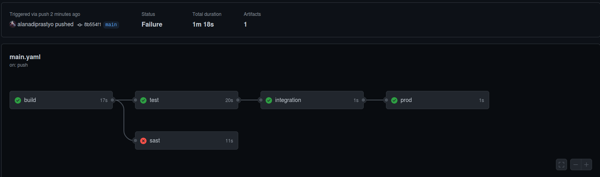
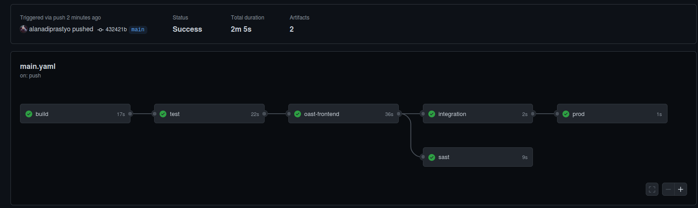

Learn how to embed Bandit into GitHub Actions
================================================================
****

Use Bandit tool to perform SAST in GitHub Actions
--------------

In this scenario, you will learn how to embed SAST in GitHub Actions.

You will learn to use Bandit in GitHub Actions and how to allow job failure when the tool found several issues.

A simple CI/CD pipeline
----------

You’ve learned about CI/CD systems using GitLab and Jenkins. Both are good systems, but they also have different features, and use cases. We will look into another CI/CD system named GitHub Actions that debuted on 13 November 2019. GitHub Actions is a CI/CD system that is built-in to GitHub with free and paid offerings. 

Let’s get started!

Add a workflow file 

```
mkdir -p .github/workflows
```
```
cat >.github/workflows/main.yaml<<EOF
name: Django                                  # workflow name

on:
  push:                                       
    branches:                                 # similar to "only" in GitLab
      - main

jobs:
  build:
    runs-on: ubuntu-latest                    # similar to "image" in GitLab
    steps:
      - uses: actions/checkout@v2

      - name: Setup python
        uses: actions/setup-python@v2
        with:
          python-version: '3.6'

      - run: |
          pip3 install --upgrade virtualenv
          virtualenv env
          source env/bin/activate
          pip install -r requirements.txt
          python manage.py check

  test:
    runs-on: ubuntu-latest
    needs: build
    steps:
      - uses: actions/checkout@v2

      - name: Setup python
        uses: actions/setup-python@v2
        with:
          python-version: '3.6'

      - run: |
          pip3 install --upgrade virtualenv
          virtualenv env
          source env/bin/activate
          pip install -r requirements.txt
          python manage.py test taskManager

  integration:
    runs-on: ubuntu-latest
    needs: test
    steps:
      - run: echo "This is an integration step"
      - run: exit 1
        continue-on-error: true

  prod:
    runs-on: ubuntu-latest
    needs: integration
    steps:
      - run: echo "This is a deploy step."
EOF
```

Embed Bandit in GitHub Actions
--------------
As discussed in the Static Analysis using Bandit exercise, we can embed Bandit in our CI/CD pipeline. However, do remember you need to run the command manually before you embed this SAST tool in the pipeline.

Go back to the DevSecOps Box machine, and copy the below content to the .github/workflows/main.yaml file under test job.

```
  sast:
    runs-on: ubuntu-latest
    needs: build
    steps:
      - uses: actions/checkout@v2

      - run: docker run --rm -v $(pwd):/src hysnsec/bandit -r /src -f json -o /src/bandit-output.json

      - uses: actions/upload-artifact@v2
        with:
          name: Bandit
          path: bandit-output.json
        if: always()                        # what is this for?
```
> To understand if: always() Please refer to [conditionals](https://docs.github.com/en/actions/reference/context-and-expression-syntax-for-github-actions#job-status-check-functions)

Commit, and push the changes to GitHub.

Any change to the repo will kick start the pipeline.

We can see the result of the pipeline by visiting our django.nv repository, clicking the Actions tab, and selecting the appropriate workflow name to see the output.



Allow the job failure
----------

We do not want to fail the builds in DevSecOps Maturity Levels 1 and 2, as security tools spit a significant amount of false positives in their default configuration.

You can use the continue-on-error syntax to not fail the build even though the tool found security issues.

```
  sast:
    runs-on: ubuntu-latest
    needs: build
    steps:
      - uses: actions/checkout@v2

      - run: docker run --rm -v $(pwd):/src hysnsec/bandit -r /src -f json -o /src/bandit-output.json
        continue-on-error: true             # allow the build to fail, similar to "allow_failure: true" in GitLab

      - uses: actions/upload-artifact@v2
        with:
          name: Bandit
          path: bandit-output.json
        if: always()                        # what is this for?
```

After adding the continue-on-error syntax, the pipeline would look like the following:

```
name: Django                                  # workflow name

on:
  push:
    branches:                                 # similar to "only" in GitLab
      - main

jobs:
  build:
    runs-on: ubuntu-latest                    # similar to "image" in GitLab
    steps:
      - uses: actions/checkout@v2

      - name: Setup python
        uses: actions/setup-python@v2
        with:
          python-version: '3.6'

      - run: |
          pip3 install --upgrade virtualenv
          virtualenv env
          source env/bin/activate
          pip install -r requirements.txt
          python manage.py check

  test:
    runs-on: ubuntu-latest
    needs: build
    steps:
      - uses: actions/checkout@v2

      - name: Setup python
        uses: actions/setup-python@v2
        with:
          python-version: '3.6'

      - run: |
          pip3 install --upgrade virtualenv
          virtualenv env
          source env/bin/activate
          pip install -r requirements.txt
          python manage.py test taskManager

  oast-frontend:
    runs-on: ubuntu-latest
    needs: test
    steps:
      - uses: actions/checkout@v2

      - uses: actions/setup-node@v2
        with:
          node-version: '10.x'

      - run: npm install

      - run: docker run --rm -v $(pwd):/src -w /src hysnsec/retire --outputformat json --outputpath retirejs-report.json --severity high
        continue-on-error: true             # allow the build to fail, similar to allow_failure: true

      - uses: actions/upload-artifact@v2
        with:
          name: RetireJS
          path: retirejs-report.json
        if: always()                        # what is this for?

  sast:
    runs-on: ubuntu-latest
    needs: oast-frontend
    steps:
      - uses: actions/checkout@v2

      - run: docker run --rm -v $(pwd):/src hysnsec/bandit -r /src -f json -o /src/bandit-output.json
        continue-on-error: true             # allow the build to fail, similar to allow_failure: true

      - uses: actions/upload-artifact@v2
        with:
          name: Bandit
          path: bandit-output.json
        if: always()                        # what is this for?

  integration:
    runs-on: ubuntu-latest
    needs: oast-frontend
    steps:
      - run: echo "This is an integration step"
      - run: exit 1
        continue-on-error: true

  prod:
    runs-on: ubuntu-latest
    needs: integration
    steps:
      - run: echo "This is a deploy step."
```

>  Did you see we sneaked oast-frontend at the end?

Go ahead and add the above content to the .github/workflows/main.yaml file to run the pipeline.

You will notice that the sast job has failed but didn’t block the other jobs from running.

As discussed, any change to the repo will kick start the pipeline.

We can see the result of the pipeline by visiting our django.nv repository, clicking the Actions tab, and selecting the appropriate workflow name to see the output.


