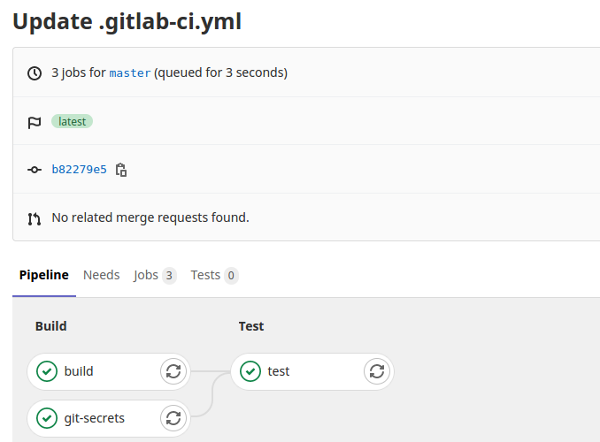
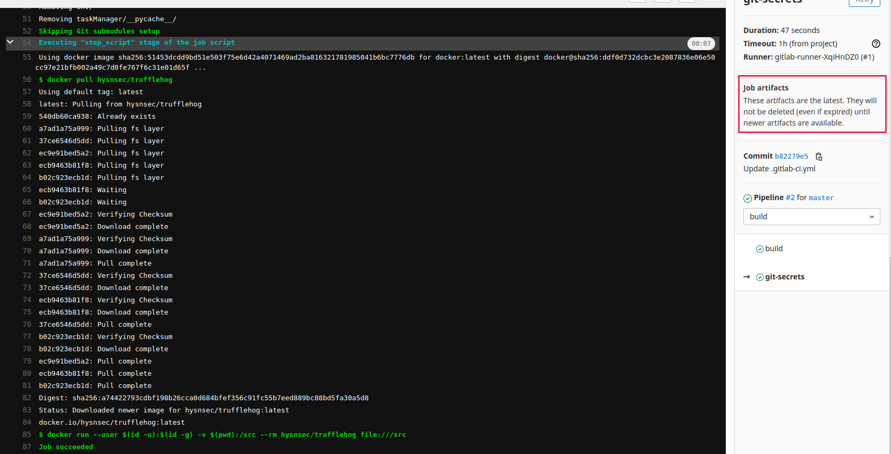
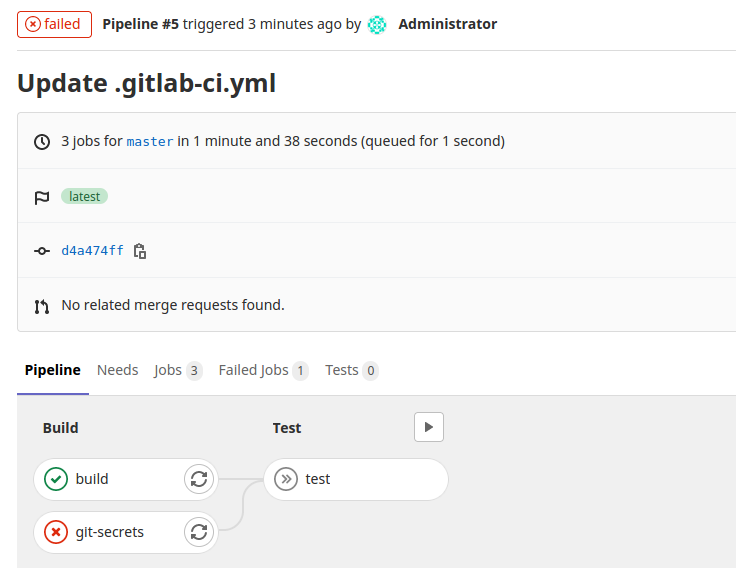
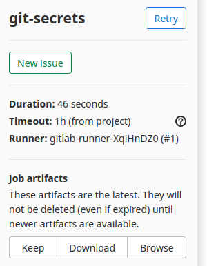
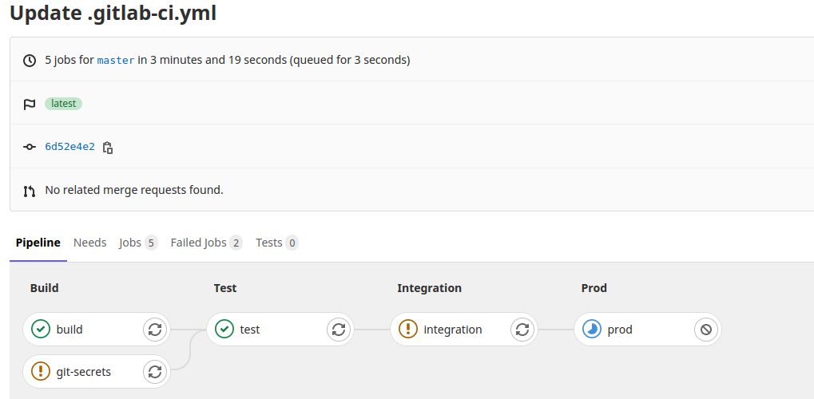
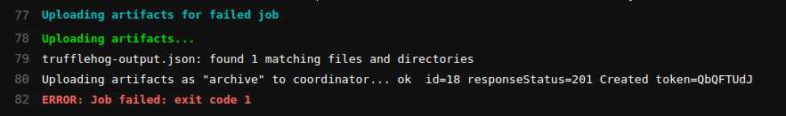

Learn how to embed the TruffleHog tool into CI/CD pipeline
================================================================

Use TruffleHog tool to perform secrets scanning in CI/CD pipeline
----------------------------------------------------------------

In this scenario, you will learn how to embed Secrets scanning in CI/CD pipeline.

You will learn to use TruffleHog in CI/CD pipeline and how to allow job failure when the tool found several issues.

A simple CI/CD pipeline
----------------------------------------------------------------

Considering your DevOps team created a simple CI pipeline with the following contents.

this example gitlab ci code
```
image: docker:latest

services:
  - docker:dind

stages:
  - build
  - test
  - release
  - preprod
  - integration
  - prod

build:
  stage: build
  image: python:3.6
  before_script:
   - pip3 install --upgrade virtualenv
  script:
   - virtualenv env
   - source env/bin/activate
   - pip install -r requirements.txt
   - python manage.py check

test:
  stage: test
  image: python:3.6
  before_script:
   - pip3 install --upgrade virtualenv
  script:
   - virtualenv env
   - source env/bin/activate
   - pip install -r requirements.txt
   - python manage.py test taskManager
```

We have two jobs in this pipeline, a **build** job and a **test** job. As a security engineer, I do not care what they are doing as part of these jobs. Why? Imagine having to learn every build/testing tool used by your DevOps team, it will be a nightmare. Instead, rely on the DevOps team for help.

Let’s log in to Gitlab using the following details.

- source code : django-nv

Next, we need to create a CI/CD pipeline by adding the above content to the **.gitlab-ci.yml** file. Click on the **Edit** button to start adding the content.

Save changes to the file using **Commit changes** button.

Verify the pipeline run
-------------

As soon as a change is made to the repository, the pipeline starts executing the jobs.

Exercise
-------------
Recall techniques you have learned in the previous module (Secure SDLC and CI/CD).

1. Read the [trufflehog documentation](https://github.com/dxa4481/truffleHog)
2. Embed git secrets scanning tool, Trufflehog in **build** stage with job name as **git-secrets**
3. Ensure the job is running in the **build** stage
4. You can either install truffleHog manually or use **hysnsec/trufflehog** docker container
5. Follow all the best practices while embedding Trufflehog in the CI/CD pipeline. Don’t forget the tool evaluation criteria
6. Can you figure out why Trufflehog didn’t give an output or file after scanning is done?

> Please try to do this exercise without looking at the solution on the next page.[skip]

Embed TruffleHog in CI/CD pipeline
--------------------------------

As discussed in the **Secrets Scanning** exercise, we can embed TruffleHog in our CI/CD pipeline. However, do remember you need to run the command manually before you embed this SAST tool in the pipeline.

copy this gitlab ci configuration to .gitlab-ci.yml

```
image: docker:20.10  # To run all jobs in this pipeline, use the latest docker image

services:
  - docker:dind       # To run all jobs in this pipeline, use a docker image which contains a docker daemon running inside (dind - docker in docker). Reference: https://forum.gitlab.com/t/why-services-docker-dind-is-needed-while-already-having-image-docker/43534

stages:
  - build
  - test
  - release
  - preprod
  - integration
  - prod

build:
  stage: build
  image: python:3.6
  before_script:
   - pip3 install --upgrade virtualenv
  script:
   - virtualenv env                       # Create a virtual environment for the python application
   - source env/bin/activate              # Activate the virtual environment
   - pip install -r requirements.txt      # Install the required third party packages as defined in requirements.txt
   - python manage.py check               # Run checks to ensure the application is working fine

test:
  stage: test
  image: python:3.6
  before_script:
   - pip3 install --upgrade virtualenv
  script:
   - virtualenv env
   - source env/bin/activate
   - pip install -r requirements.txt
   - python manage.py test taskManager

git-secrets:
  stage: build
  script:
    - docker pull hysnsec/trufflehog
    - docker run --user $(id -u):$(id -g) -v $(pwd):/src --rm hysnsec/trufflehog git http://gitlab-ce-cxlx0c4v.lab.practical-devsecops.training/root/django-nv.git
```

As discussed, any change to the repo kick starts the pipeline.


we can see the result of this pipeline by this picture:




> As you can see, Trufflehog didn’t give us any output as it did on the DevSecOps Box. Why?

Let’s try running the **git status** command after the Trufflehog command and see the job’s output.

```
git-secrets:
  stage: build
  script:
    - docker pull hysnsec/trufflehog
    - docker run --user $(id -u):$(id -g) -v $(pwd):/src --rm hysnsec/trufflehog file:///src
    - git status
```

Notice the last line of the above job, we have added **git status** command.

> HEAD detached at c4560d9
>
> nothing to commit, working tree clean

The output tells us that **HEAD is detached**; what does it mean? It means we’re not on a branch but checked out a specific commit in the history. **Trufflehog needs us to be on a branch**. Hence Trufflehog didn’t find any secrets, and we can fix it with the following jobs.

Our current job configuration is:
```
git-secrets:
  stage: build
  script:
    - docker run --user $(id -u):$(id -g) -v $(pwd):/src --rm hysnsec/trufflehog git http://gitlab-ce-7w3lmtto.lab.practical-devsecops.training/root/django-nv.git
```
The above configuration uses Trufflehog to scan the entire git repository for secrets.

Let’s break down the command:
- --user $(id -u):$(id -g): runs the container with the current user’s UID and GID, avoiding permission issues.
- -v $(pwd):/src: mounts the current directory to /src in the container.
- --rm: removes the container after it finishes running.
- hysnsec/trufflehog: the Docker image we’re using.
- git http://gitlab-ce-cxlx0c4v.lab.practical-devsecops.training/root/django-nv.git: tells Trufflehog to use the git mode and scan the specified repository URL.

The git option in Trufflehog allows it to scan the entire git history of the repository, which is more thorough than just scanning the current state of the files. This is particularly useful for finding secrets that might have been committed in the past and then removed

# Notes
When using the git option with Trufflehog, we provide the repository URL as an argument. This allows Trufflehog to clone the repository and scan its entire history, regardless of the current state of the working directory in the CI/CD environment. This approach ensures a comprehensive scan of the entire git history for potential secrets.

Let’s move to the next step

# Allow the job failure

We do not want to fail the builds/jobs/scan in DevSecOps Maturity Levels 1 and 2, as security tools spit a significant amount of false positives.

You can use the allow_failure tag to not fail the build even though the tool found issues.
```
git-secrets:
  stage: build
  script:
    - docker run -v $(pwd):/src --rm hysnsec/trufflehog git http://gitlab-ce-cxlx0c4v.lab.practical-devsecops.training/root/django-nv.git --fail --json | tee trufflehog-output.json
  artifacts:
    paths: [trufflehog-output.json]
    when: always  # What is this for?
    expire_in: one week
  allow_failure: true   #<--- allow the build to fail but don't mark it as such
```
Copy text below

```
git-secrets:
  stage: build
  script:
    - apk add git
    - git checkout master
    - docker run -v $(pwd):/src --rm hysnsec/trufflehog file:///src --json | tee trufflehog-output.json
  artifacts:
    paths: [trufflehog-output.json]
    when: always  # What is this for?
    expire_in: one week
```
Picture pipeline failed but the job artifact created success




The **git** function helps us in cloning the source code and then checking out the **master** branch.

We do not want to fail the builds/jobs/scan in **DevSecOps Maturity Levels 1 and 2**, as security tools spit a significant amount of false positives.

You can use the **allow_failure** tag to not fail the build even though the tool found issues.

```
git-secrets:
  stage: build
  script:
    - apk add git
    - git checkout master
    - docker run -v $(pwd):/src --rm hysnsec/trufflehog file:///src --json | tee trufflehog-output.json
  artifacts:
    paths: [trufflehog-output.json]
    when: always  # What is this for?
    expire_in: one week
  allow_failure: true   #<--- allow the build to fail but don't mark it as such
```

> Why we’re adding apk add git?
> 
> See the first line in **.gitlab-ci.yml** file, the image keyword is the name of the Docker image the Docker executor runs to perform the CI tasks, and we use **docker:latest (Alpine-based)** image as default.

After adding the allow_failure tag, the pipeline would look like the following.

copy text below to full pipeline

```
image: docker:latest

services:
  - docker:dind

stages:
  - build
  - test
  - release
  - preprod
  - integration
  - prod

build:
  stage: build
  image: python:3.6
  before_script:
   - pip3 install --upgrade virtualenv
  script:
   - virtualenv env
   - source env/bin/activate
   - pip install -r requirements.txt
   - python manage.py check

test:
  stage: test
  image: python:3.6
  before_script:
   - pip3 install --upgrade virtualenv
  script:
   - virtualenv env
   - source env/bin/activate
   - pip install -r requirements.txt
   - python manage.py test taskManager

git-secrets:
  stage: build
  script:
    - apk add git
    - git checkout master
    - docker run -v $(pwd):/src --rm hysnsec/trufflehog file:///src --json | tee trufflehog-output.json
  artifacts:
    paths: [trufflehog-output.json]
    when: always  # What is this for?
    expire_in: one week
  allow_failure: true

integration:
  stage: integration
  script:
    - echo "This is an integration step"
    - exit 1
  allow_failure: true # Even if the job fails, continue to the next stages

prod:
  stage: prod
  script:
    - echo "This is a deploy step."
  when: manual # Continuous Delivery
```
You will notice that the **git-secrets** job failed however it didn’t block others from continuing further.



