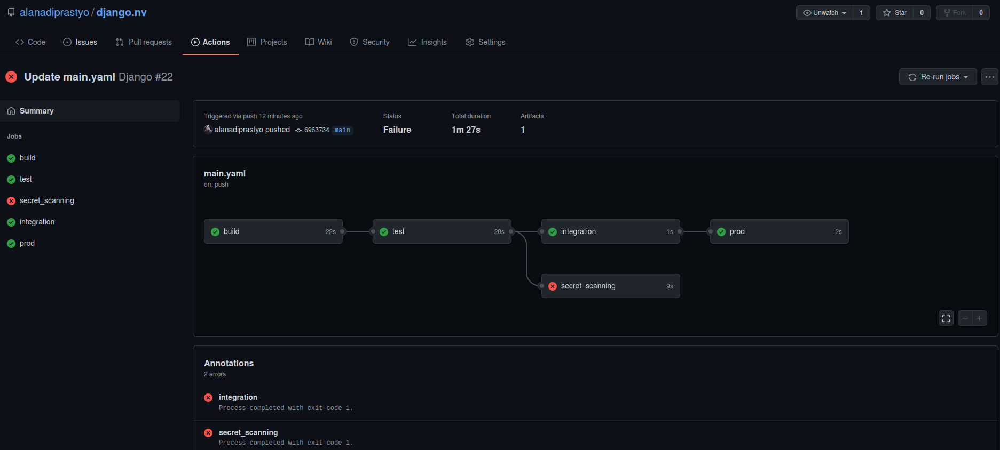
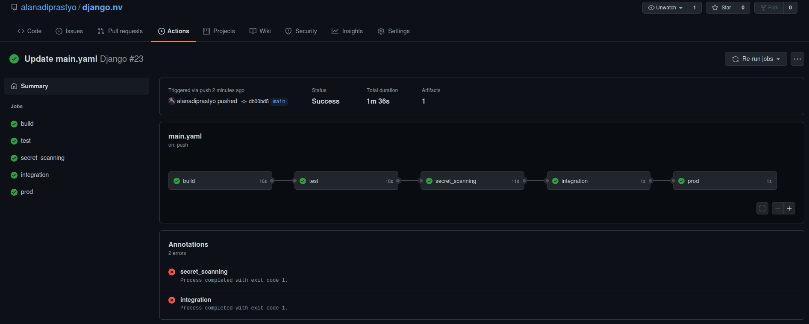

Learn how to embed TruffleHog into GitHub Actions
================================================

Use TruffleHog tool to perform SAST in GitHub Actions
----------------------------------------------------------------

In this scenario, you will learn how to embed SAST in GitHub Actions.

You will learn to use TruffleHog in GitHub Actions and how to allow job failure when the tool found several issues.

A simple CI/CD pipeline
--------------

You’ve learned about CI/CD systems using GitLab and Jenkins. Both are good systems, but they also have different features, and use cases. We will look into another CI/CD system named GitHub Actions that debuted on 13 November 2019. **GitHub Actions** is a CI/CD system that is built-in to GitHub with **free** and paid offerings. 

### 1. Create a new repository

> If you haven’t registered for a GitHub account, please sign up for an account [here](https://github.com/join?ref_cta=Sign+up&ref_loc=header+logged+out&ref_page=%2F&source=header-home)

First, we need to create a repository in our GitHub account by visiting https://github.com/new.

Create a repository named *django.nv*, you can also check the box with Public or Private options, and please ignore **Initialize this repository with** section for now.

Click the **Create repository** button.

### 2. Create a Personal Access Token (PAT)

Next, we will create and use PAT for git authentication in DevSecOps Box because GitHub will not support account passwords starting August 2021.

Let’s create PAT by visiting https://github.com/settings/tokens,then click **Generate new token** button and give your token a name e.g. *django*

Select repo option to access repositories from the command line, and scroll down to generate a new token.

> The token will have a format like this ghp_xxxxxxxxx.

Once you have the token, please copy and save it as a file in DevSecOps Box, so we can use the token whenever needed.

### 3. Intial git setup

To work with git repositories via Command Line Interface (CLI), aka terminal/command prompt, we need to set up a user and an email. We can use git config command to configure git user and email.

```
git config --global user.email "your_email@gmail.com"
git config --global user.name "your_username"
```

> You need to use your email and username, which are registered in GitHub.
>
> **Please don’t use your company’s GitHub credentials or token to practice these exercises.**

### 4. Download the repository
Let’s start by cloning django.nv in DevSecOps Box.

```
git clone https://gitlab.practical-devsecops.training/pdso/django.nv.git
```

By cloning the above repository, we created a local copy of the remote repository.

```
cd django.nv
```
Since this repository was cloned from Gitlab, the remote URL of this Git repository is going to point to the Gitlab URL. Let’s rename the repository’s Git URL to point to GitHub, enabling us to push our code to GitHub.

```
git remote rename origin old-origin
```
> In the command below, please change “username” with your GitHub username.

```
git remote add origin https://github.com/username/django.nv.git
```
Let’s check the status of our git repository.
```
git status
```

We are in the **master** branch and we need to create one more branch called main as a default branch.
```
git checkout -b main
```

> Why do we need a new branch? Because in this exercise we will use the main branch as a control to run the pipeline in every commit. If you don’t do this, you will not be able to see any pipeline in your repository.
>
> Read more about [Renaming the default branch from master.](https://github.com/github/renaming)

Then, let’s push the code to the GitHub repository.
```
git push -u origin main
```
And enter your GitHub credentials when prompted (please use **Personal Access Token** as a password), then the code will be pushed to the GitHub repository.

### 5. Add a workflow file to the repository
To use **GitHub Actions**, you need to create **.github/workflows** directory and create a new YAML file named *main.yaml* or any other desired name because each file in the **.github/workflows** directory which has a .yaml extension will define a workflow.

Let’s create a simple workflow by entering the following commands in DevSecOps Box.

```
mkdir -p .github/workflows
```
```
cat >.github/workflows/main.yaml<<EOF
name: Django                                  # workflow name

on:
  push:                                       
    branches:                                 # similar to "only" in GitLab
      - main

jobs:
  build:
    runs-on: ubuntu-latest                    # similar to "image" in GitLab
    steps:
      - uses: actions/checkout@v2

      - name: Setup python
        uses: actions/setup-python@v2
        with:
          python-version: '3.6'

      - run: |
          pip3 install --upgrade virtualenv
          virtualenv env
          source env/bin/activate
          pip install -r requirements.txt
          python manage.py check

  test:
    runs-on: ubuntu-latest
    needs: build
    steps:
      - uses: actions/checkout@v2

      - name: Setup python
        uses: actions/setup-python@v2
        with:
          python-version: '3.6'

      - run: |
          pip3 install --upgrade virtualenv
          virtualenv env
          source env/bin/activate
          pip install -r requirements.txt
          python manage.py test taskManager

  integration:
    runs-on: ubuntu-latest
    needs: test
    steps:
      - run: echo "This is an integration step"
      - run: exit 1
        continue-on-error: true

  prod:
    runs-on: ubuntu-latest
    needs: integration
    steps:
      - run: echo "This is a deploy step."
EOF
```

> If you are not comfortable with the syntax, explore the GitHub Actions syntax at https://docs.github.com/en/actions/reference/workflow-syntax-for-github-actions#about-yaml-syntax-for-workflows

Let’s add this file to the repository and commit the changes. 

```
git add .github/workflows/main.yaml
git commit -m "Add github workflows"
```

### 6. Push the changes to the repository

Since git is a decentralized source code management system, all changes are made in your local git repository. You have to push these changes to the remote server for the committed changes to reflect on the remote git repository.

Let’s push the changes to the remote git repository using the **git push** command.

```
git push origin main
```

### 7. Verify the pipeline runs

Any change to the repo, will kick start the pipeline.

We can see the result of the pipeline by visiting our **django.nv** repository, clicking the Actions tab, and selecting the appropriate workflow name to see the output.

> You can find more details at https://docs.github.com/en/actions/learn-github-actions/introduction-to-github-actions#jobs.

Embed TruffleHog in GitHub Actions
--------------
As discussed in the **Static Analysis using TruffleHog** exercise, we can embed TruffleHog in our CI/CD pipeline. However, do remember you need to run the command manually before you embed this SAST tool in the pipeline.

Go back to the DevSecOps Box machine, and copy the below content to the **.github/workflows/main.yaml** file under **test** job.

```
  secret_scanning:
    runs-on: ubuntu-latest
    needs: test
    steps:
      - uses: actions/checkout@v2

      - run: docker run --rm -v $(pwd):/src hysnsec/trufflehog file:///src --json > trufflehog-output.json

      - uses: actions/upload-artifact@v2
        with:
          name: TruffleHog
          path: trufflehog-output.json
        if: always()                        # what is this for?
```
> To understand if: always() Please refer to [conditionals](https://docs.github.com/en/actions/reference/context-and-expression-syntax-for-github-actions#job-status-check-functions).

Commit, and push the changes to GitHub.

Any change to the repo will kick start the pipeline.

We can see the result of the pipeline by visiting our **django.nv** repository, clicking the **Actions** tab, and selecting the appropriate workflow name to see the output.



Allow the job failure
--------------

We do not want to fail the builds/jobs/scan in **DevSecOps Maturity Levels 1 and 2**, as security tools spit a significant amount of false positives.

You can use the **continue-on-error** syntax to not fail the build even though the tool found security issues.

```
  secret_scanning:
    runs-on: ubuntu-latest
    needs: test
    steps:
      - uses: actions/checkout@v2

      - run: docker run --rm -v $(pwd):/src hysnsec/trufflehog file:///src --json > trufflehog-output.json
        continue-on-error: true             # allow the build to fail, similar to "allow_failure: true" in GitLab

      - uses: actions/upload-artifact@v2
        with:
          name: TruffleHog
          path: trufflehog-output.json
        if: always()                        # what is this for?
```

After adding the **continue-on-error** syntax, the pipeline would look like the following:
```
name: Django                                  # workflow name

on:
  push:
    branches:                                 # similar to "only" in GitLab
      - main

jobs:
  build:
    runs-on: ubuntu-latest                    # similar to "image" in GitLab
    steps:
      - uses: actions/checkout@v2

      - name: Setup python
        uses: actions/setup-python@v2
        with:
          python-version: '3.6'

      - run: |
          pip3 install --upgrade virtualenv
          virtualenv env
          source env/bin/activate
          pip install -r requirements.txt
          python manage.py check

  test:
    runs-on: ubuntu-latest
    needs: build
    steps:
      - uses: actions/checkout@v2

      - name: Setup python
        uses: actions/setup-python@v2
        with:
          python-version: '3.6'

      - run: |
          pip3 install --upgrade virtualenv
          virtualenv env
          source env/bin/activate
          pip install -r requirements.txt
          python manage.py test taskManager

  secret_scanning:
    runs-on: ubuntu-latest
    needs: test
    steps:
      - uses: actions/checkout@v2

      - run: docker run --rm -v $(pwd):/src hysnsec/trufflehog file:///src --json > trufflehog-output.json
        continue-on-error: true             # allow the build to fail, similar to "allow_failure: true" in GitLab

      - uses: actions/upload-artifact@v2
        with:
          name: TruffleHog
          path: trufflehog-output.json
        if: always()                        # what is this for?

  integration:
    runs-on: ubuntu-latest
    needs: secret_scanning
    steps:
      - run: echo "This is an integration step"
      - run: exit 1
        continue-on-error: true

  prod:
    runs-on: ubuntu-latest
    needs: integration
    steps:
      - run: echo "This is a deploy step."
```

Go ahead and add the above content to the **.github/workflows/main.yaml** file to run the pipeline.

You will notice that the **secret_scanning** job has failed but didn’t block the other jobs from running.

We can see the result of the pipeline by visiting our **django.nv** repository, clicking the **Actions** tab, and selecting the appropriate workflow name to see the output.

