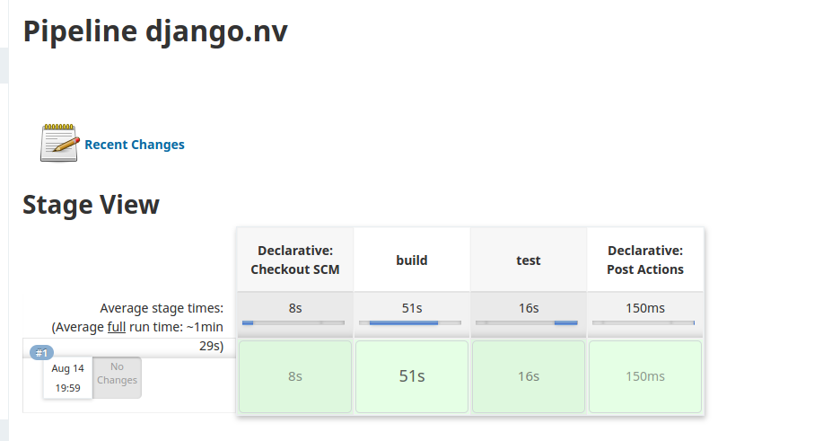

Learn how to embed TruffleHog tool into Jenkins CI/CD pipeline
================================================================

Use TruffleHog tool to perform secrets scanning in Jenkins CI/CD pipeline
----------------------------------------------------------------

In this scenario, you will learn how to embed Secrets Scanning in Jenkins CI/CD pipeline.

Create a new job
-----------------

> The Jenkins system is already configured with GitLab. If you wish to know **how to configure Jenkins with GitLab**, you can check out this link.

We will create a new job in Jenkins by visiting jenkins dashboard

Provide a name for your new item, e.g., **django.nv**, select the **Pipeline** option, and click on the **OK** button.

In the next screen, click on the **Build Triggers** tab, check the **Build when a change is pushed to GitLab.....** checkbox.

At the bottom right-hand side, just below the **Comment (regex) for triggering a build** form field, you will find the **Advanced…** button. Please click on it.

Then, click on the **Generate** button under **Secret token** to generate a token. We will use this token for GitLab’s Webhook Settings. This webhook setting will allow GitLab to let Jenkins know whenever a change is made to the repository.

Please visit the following GitLab URL to set up the Jenkins webhook.

Fill the form using the following details.

URL : http://jenkins.example.com/project/django.nv
secret Token: Paste the secret token we just generated above.

Click on the **Add webhook** button, and **go back to the Jenkins tab** to continue the setup process.

Click on the **Pipeline** tab, and select **Pipeline script from SCM** from **Definition** options. Once you do that, few more options would be made available to you. 

Select **Git** as **SCM**, enter our **django.nv** repository http url.
Repository URL : http://gitlab-ce-XqiHnDZ0.lab.practical-devsecops.training/root/django-nv.git

Let’s add the credentials by clicking on the **Add** button (the one with a key symbol). Select the **Jenkins** option and fill the pop-up form with the following details.

> username  : root
>
> password  : rahasia
>
> id        : gitlab-auth

Click on the **Add** button, and select our new credentials from the Credentials Dropdown.

The error we experienced before should be gone by now.

Finally, click the Save button.

A simple CI/CD pipeline
------------------------

Considering your DevOps team created a simple **Jenkinsfile** with the following contents.

```
pipeline {
    agent any

    options {
        gitLabConnection('gitlab')
    }

    stages {
        stage("build") {
            agent {
                docker {
                    image 'python:3.6'
                    args '-u root'
                }
            }
            steps {
                sh """
                pip3 install --user virtualenv
                python3 -m virtualenv env
                . env/bin/activate
                pip3 install -r requirements.txt
                python3 manage.py check
                """
            }
        }
        stage("test") {
            agent {
                docker {
                    image 'python:3.6'
                    args '-u root'
                }
            }
            steps {
                sh """
                pip3 install --user virtualenv
                python3 -m virtualenv env
                . env/bin/activate
                pip3 install -r requirements.txt
                python3 manage.py test taskManager
                """
            }
        }
    }
    post {
        failure {
            updateGitlabCommitStatus(name: "${env.STAGE_NAME}", state: 'failed')
        }
        unstable {
            updateGitlabCommitStatus(name: "${env.STAGE_NAME}", state: 'failed')
        }
        success {
            updateGitlabCommitStatus(name: "${env.STAGE_NAME}", state: 'success')
        }
        aborted {
            updateGitlabCommitStatus(name: "${env.STAGE_NAME}", state: 'canceled')
        }
        always { 
            deleteDir()                     // clean up workspace
        }
    }
}
```
We have two jobs in this pipeline, a **build** stage and a **test** stage. As a security engineer, I do not care what they are doing as part of these stages. Why? Imagine having to learn every build/testing tool used by your DevOps team. It will be a nightmare. Instead, rely on the DevOps team for help.

Let’s login into Gitlab. - source code already exists in folder source-code django-nv

Add a new file to the repository by clicking on the +(plus) button and give it a name as *Jenkinsfile*, then add the above script into the file.

Save changes to the file using the **Commit changes** button.

Verify the pipeline run
-----------------

Since we want to use Jenkins to execute the CI/CD jobs, we need to remove .gitlab-ci.yml from the git repository. Doing so will prevent Gitlab from running the CI jobs on both the Gitlab Runner and the Jenkins systems.

> Don’t forget to disable Auto DevOps in Gitlab as it will execute the job when any changes are pushed to the repository even though the .gitlab-ci.yaml file is missing.
>
> Visit http://gitlab-ce-XqiHnDZ0.lab.practical-devsecops.training/root/django-nv/-/settings/ci_cd to disable it.

output pipeline at jenkins dashboard


Exercise
---------
Recall techniques you have learned in the previous module (Secure SDLC and CI/CD).

1. Read the [Trufflehog documentation](https://github.com/dxa4481/truffleHog)
2. Embed Trufflehog as **git-secrets** stage and ensure the stage is running
3. You can either install the Trufflehog manually or use **hysnsec/trufflehog** docker container
4. Follow all the best practices while embedding Trufflehog in the CI/CD pipeline. Don’t forget the tool evaluation criteria
5. Can you figure out why Trufflehog didn’t give output or file after scanning is done?

Embed TruffleHog in Jenkins
-----------------
As discussed in the **Secrets Scanning** exercise, we can embed TruffleHog in our CI/CD pipeline. However, you need to test the command manually before you embed this SAST tool in the pipeline.

```
pipeline {
    agent any

    options {
        gitLabConnection('gitlab')
    }

    stages {
        stage("build") {
            agent { 
                docker { 
                    image 'python:3.6'
                    args '-u root'
                }
            }
            steps {
                sh """
                pip3 install --user virtualenv
                python3 -m virtualenv env
                . env/bin/activate
                pip3 install -r requirements.txt
                python3 manage.py check
                """
            }
        }
        stage("test") {
            agent { 
                docker { 
                    image 'python:3.6'
                    args '-u root'
                }
            }
            steps {
                sh """
                pip3 install --user virtualenv
                python3 -m virtualenv env
                . env/bin/activate
                pip3 install -r requirements.txt
                python3 manage.py test taskManager
                """
            }
        }
        stage("git-secrets") {
            steps {
                sh "docker run -v \$(pwd):/src --rm hysnsec/trufflehog file:///src --json" 
            }
        }
    }
    post {
        failure {
            updateGitlabCommitStatus(name: STAGE_NAME, state: 'failed')
        }
        unstable {
            updateGitlabCommitStatus(name: STAGE_NAME, state: 'failed')
        }
        success {
            updateGitlabCommitStatus(name: STAGE_NAME, state: 'success')
        }
        aborted {
            updateGitlabCommitStatus(name: STAGE_NAME, state: 'skipped')
        }
        always { 
            deleteDir()                     // clean up workspace
        }
    }
}
```

As discussed, any change to the repo kick starts the pipeline.

Click on the appropriate build history to see the output on jenkins.

> As you can, Trufflehog didn’t give us any output as we did on the DevSecOps Box. Why?

Let’s try running the git status command after the Trufflehog command and see the output.
> HEAD detached at c948d9c
>
> nothing to commit, working tree clean

The output tells us that HEAD is detached; what does it mean? It means we’re not on a branch but checked out a specific commit in the history. Trufflehog needs us to be on a branch. Hence Trufflehog didn’t find any secrets.

```
        stage("git-secrets") {
            steps {
                git credentialsId: 'gitlab-auth', url: 'http://gitlab-ce-XqiHnDZ0.lab.practical-devsecops.training/root/django-nv.git'
                sh "docker run -v \$(pwd):/src --rm hysnsec/trufflehog file:///src --json"
            }
        }
```
> After changes the pipeline will error

> The git plugin fetches commits from one or more remote repositories and performs a checkout in the agent workspace.

The **git** function helps us in cloning the source code and then checking out the master branch.

We do not want to fail the builds/jobs/scan in **DevSecOps Maturity Levels 1 and 2**, as security tools spit a significant amount of false positives.

You can use the **catchError** function to “not fail the build” even though the tool found security issues.

>Reference: https://www.jenkins.io/doc/pipeline/steps/workflow-basic-steps.

```
        stage("git-secrets") {
            steps {
                catchError(buildResult: 'SUCCESS', stageResult: 'UNSTABLE') {     // Allow the sast stage to fail
                    git credentialsId: 'gitlab-auth', url: 'http://gitlab-ce-XqiHnDZ0.lab.practical-devsecops.training/root/django-nv.git'
                    sh "docker run -v \$(pwd):/src --rm hysnsec/trufflehog file:///src --json | tee trufflehog-output.json "
                }
            }
```
After adding the catchError function, the pipeline would look like the following.

```
pipeline {
    agent any

    options {
        gitLabConnection('gitlab')
    }

    stages {
        stage("build") {
            agent {
                docker {
                    image 'python:3.6'
                    args '-u root'
                }
            }
            steps {
                sh """
                pip3 install --user virtualenv
                python3 -m virtualenv env
                . env/bin/activate
                pip3 install -r requirements.txt
                python3 manage.py check
                """
            }
        }
        stage("test") {
            agent {
                docker {
                    image 'python:3.6'
                    args '-u root'
                }
            }
            steps {
                sh """
                pip3 install --user virtualenv
                python3 -m virtualenv env
                . env/bin/activate
                pip3 install -r requirements.txt
                python3 manage.py test taskManager
                """
            }
        }
        stage("git-secrets") {
            steps {
                catchError(buildResult: 'SUCCESS', stageResult: 'UNSTABLE') {     // Allow the sast stage to fail
                    git credentialsId: 'gitlab-auth', url: 'http://gitlab-ce-XqiHnDZ0.lab.practical-devsecops.training/root/django-nv.git'
                    sh "docker run -v \$(pwd):/src --rm hysnsec/trufflehog file:///src --json | tee trufflehog-output.json"
                }
            }
            post {
                always {
                    archiveArtifacts artifacts: 'trufflehog-output.json', fingerprint: true
                }
            }
        }
        stage("integration") {
            steps {
                catchError(buildResult: 'SUCCESS', stageResult: 'UNSTABLE') {
                    echo "This is an integration step."
                    sh "exit 1"
                }
            }
        }
        stage("prod") {
            steps {
                input "Deploy to production?"
                echo "This is a deploy step."
            }
        }
    }
    post {
        failure {
            updateGitlabCommitStatus(name: STAGE_NAME, state: 'failed')
        }
        unstable {
            updateGitlabCommitStatus(name: STAGE_NAME, state: 'failed')
        }
        success {
            updateGitlabCommitStatus(name: STAGE_NAME, state: 'success')
        }
        aborted {
            updateGitlabCommitStatus(name: STAGE_NAME, state: 'skipped')
        }
        always {
            deleteDir()                     // clean up workspace
        }
    }
}
```

You will notice that the git-secrets stage failed. However, it didn’t block other jobs from continuing further.