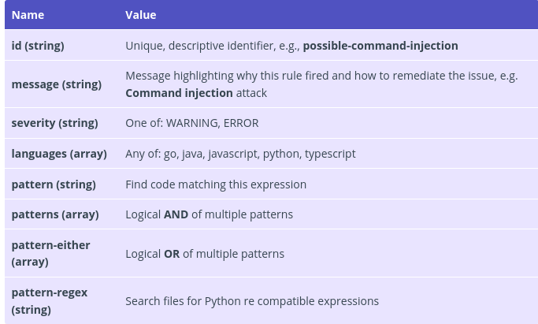
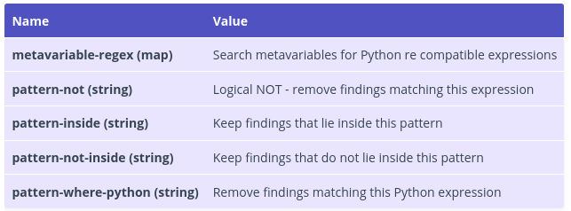

We will learn how to create a custom rule for semgrep
================================================================

Download the source code
--------------------------------------------------------------

We will do all the exercises locally first in DevSecOps-Box, so let’s start the exercise.

First, we need to download the source code of the project from our git repository.

```
git clone https://gitlab.practical-devsecops.training/pdso/django.nv webapp
cd webapp
```

Install Semgrep
----------------------------------------

> check documentation at static-analysis-using-semgrep

Pattern syntax
--------------

Semgrep tool has several ways to specify the Pattern syntax, for e.g., Ellipsis operator (…). This operator is used to match a sequence of zero or more arguments, statements, or characters in the given code.

> os.system(...)

The above pattern will match the following functions:

```
os.system("command")
os.system(command)
os.system("really_weird_command")
os.system(really_weird_command)
```

Metavariables can be used to track values across a specific code scope. This includes variables, functions, arguments, classes, object methods, imports, exceptions, and more especially when we don’t know the value or contents beforehand.

> $X = $Y

```
semgrep --lang python -e '$X = $Y' .
```

output

```
taskManager/forms.py
27:    user_list = User.objects.order_by('date_joined')
--------------------------------------------------------------------------------
28:    user_tuple = []
--------------------------------------------------------------------------------
29:    counter = 1
--------------------------------------------------------------------------------
32:        counter = counter + 1
--------------------------------------------------------------------------------
41:    task_list = []
--------------------------------------------------------------------------------
42:    tasks = Task.objects.all()
--------------------------------------------------------------------------------
47:    task_tuple = []
--------------------------------------------------------------------------------
48:    counter = 1
--------------------------------------------------------------------------------
51:        counter = counter + 1
--------------------------------------------------------------------------------
60:    proj_list = Project.objects.all()
--------------------------------------------------------------------------------
61:    proj_tuple = []
--------------------------------------------------------------------------------
...[SNIP]...
```

Lets take another example.

> $X.objects.get

The above pattern will match all code snippets that have suffix .object.get

```
semgrep --lang python -e '$X.objects.get' .
```
output

```
taskManager/views.py
42:    proj = Project.objects.get(pk=project_id)
--------------------------------------------------------------------------------
53:                user = User.objects.get(pk=userid)
--------------------------------------------------------------------------------
54:                task = Task.objects.get(pk=taskid)
--------------------------------------------------------------------------------
88:                user = User.objects.get(pk=userid)
--------------------------------------------------------------------------------
89:                project = Project.objects.get(pk=projectid)
--------------------------------------------------------------------------------
130:                    grp = Group.objects.get(name=accesslevel)
--------------------------------------------------------------------------------
133:                specified_user = User.objects.get(pk=post_data["userid"])
--------------------------------------------------------------------------------
174:        proj = Project.objects.get(pk=project_id)
--------------------------------------------------------------------------------
208:    file = File.objects.get(pk=file_id)
--------------------------------------------------------------------------------
222:    user = User.objects.get(pk=user_id)
--------------------------------------------------------------------------------
244:        proj = Project.objects.get(pk=project_id)
--------------------------------------------------------------------------------
```

As you can see the Semgrep is pretty powerful.

Rule syntax
----------------------------------------------------------------

Semgrep have several ways to represent custom Rules. Let’s explore few of these in order to write semgrep rules.

Schema
------

> The following fields are required while creating a rule in Semgrep.



> The following fields can be used inside patterns or pattern-either fields to target specific parts of the code



If you wish to search for a possible Command Injection vulnerability in our source code, we can write the following semgrep rule.

```
cat > command_injection.yaml <<EOF
rules:
- id: Possible Command Injection
  patterns:
  - pattern: os.system(...)
  - pattern-not: os.system("...")
  message: Possible Command Injection
  languages:
  - python
  severity: WARNING
EOF
```
Let’s run a semgrep scan using the above rule.

```
semgrep --lang python -f command_injection.yaml .
```
output

```
running 1 rules...
taskManager/misc.py
severity:warning rule:Possible Command Injection: Possible Command Injection
33:    os.system(
34:        "mv " +
35:        uploaded_file.temporary_file_path() +
36:        " " +
37:        "%s/%s" %
38:        (upload_dir_path,
39:         title))
ran 1 rules on 50 files: 1 findings
```

> pattern-not: os.system(“…”) specifies that semgrep should not search os.system function that uses harcoded commands.

We can also use pattern-inside to search a pattern inside code blocks e.g., inside an if statement, a function call, a class or anything that contains a code block.

```
cat > find_project_db_get_call.yaml <<EOF
rules:
- id: find-get-project-db-value
  patterns:
  - pattern: Project.objects.get(...)
  - pattern-inside: |
      def \$FUNC(request):
        ...
  message: Get project db value
  languages:
  - python
  severity: WARNING
EOF
```

```
semgrep --lang python -f find_project_db_get_call.yaml .
```

output
```
running 1 rules...
taskManager/views.py
severity:warning rule:find-get-project-db-value: Get project db value
89:                project = Project.objects.get(pk=projectid)
ran 1 rules on 50 files: 1 findings
```

Exercise
---------

This is the example code from webapp, you must create a semgrep rule to find SQL Injection vulnerability.

```
def upload(request, project_id):

    if request.method == 'POST':

        proj = Project.objects.get(pk=project_id)
        form = ProjectFileForm(request.POST, request.FILES)

        if form.is_valid():
            name = request.POST.get('name', False)
            upload_path = store_uploaded_file(name, request.FILES['file'])

            #A1 - Injection (SQLi)
            curs = connection.cursor()
            curs.execute(
                "insert into taskManager_file ('name','path','project_id') values ('%s','%s',%s)" %
                (name, upload_path, project_id))

            # file = File(
            #name = name,
            #path = upload_path,
            # project = proj)

            # file.save()

            return redirect('/taskManager/' + project_id +
                            '/', {'new_file_added': True})
        else:
            form = ProjectFileForm()
    else:
        form = ProjectFileForm()
    return render_to_response(
        'taskManager/upload.html', {'form': form}, RequestContext(request))
```